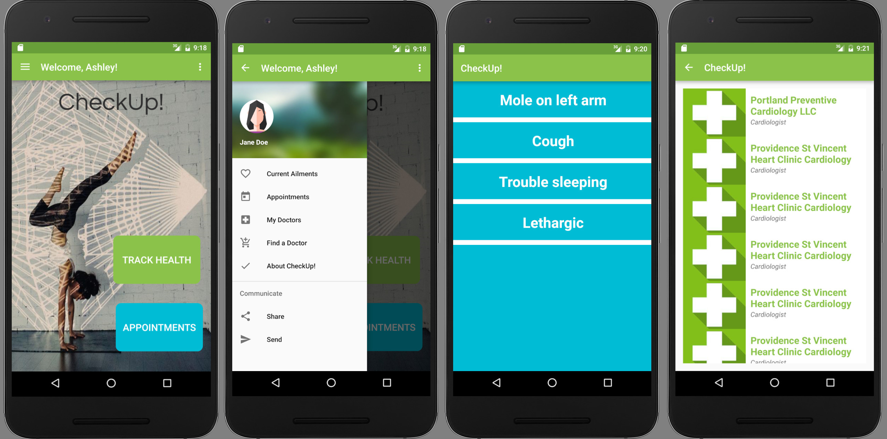

# CheckUp! Android App
## By Ashley Maceli - Epicodus 2016

## Description

CheckUp is a new kind of health tracking app. Still in development as an ongoing independent project for the Android course at Epicodus. Keep track of your important health questions and concerns. Add those to your scheduled appointments and refer to it during your appointment. It is so easy to forget a question you wanted to ask your Doctor and it's too often that you only remember after the appointment! Check Up wants to help keep these records organized and available for you to make the most of your appointments! CheckUp is meant to be used as a way to track these ailments, appointments, doctor's notes and smart reminders through your life to make you the healthiest and happiest you can be!

## Current Features
* Create new accounts, log in and out.
* Search for doctors by location and specialty. Search parameters added to saved preferences.
* Doctors may be scrolled through either in the ListView or through details pages.
* Add ailments with details. Ailments may be scrolled through either in the ListView or through details pages.
* Navigation Drawer for quick navigation to most important activities.

## Future Features

* Add time stamps, severity rating and updatability to ailments.
* Adding appointments with "smart" reminders.
* Adding doctors and ailments to appointments.

## Known Bugs

Project still in development. No major bugs at this time.

## Prerequisites

You will need the following things properly installed on your computer.

* Android Studio

## Running / Development

* `git clone https://github.com/AshleyRayMaceli/check-up-android` this repository
* change into the new directory
* open in Android Studio
* boot up emulator with the Nexus 6P model
* press the 'run' button (looks like a green play button)

## Technologies Used

Java, Android Studio, Google Firebase, BetterDoctor API

### Running Tests

No tests at this time.

### License

The MIT License (MIT)

Copyright (c) 2016 - Ashley Maceli

Permission is hereby granted, free of charge, to any person obtaining a copy
of this software and associated documentation files (the "Software"), to deal
in the Software without restriction, including without limitation the rights
to use, copy, modify, merge, publish, distribute, sublicense, and/or sell
copies of the Software, and to permit persons to whom the Software is
furnished to do so, subject to the following conditions:

The above copyright notice and this permission notice shall be included in all
copies or substantial portions of the Software.

THE SOFTWARE IS PROVIDED "AS IS", WITHOUT WARRANTY OF ANY KIND, EXPRESS OR
IMPLIED, INCLUDING BUT NOT LIMITED TO THE WARRANTIES OF MERCHANTABILITY,
FITNESS FOR A PARTICULAR PURPOSE AND NONINFRINGEMENT. IN NO EVENT SHALL THE
AUTHORS OR COPYRIGHT HOLDERS BE LIABLE FOR ANY CLAIM, DAMAGES OR OTHER
LIABILITY, WHETHER IN AN ACTION OF CONTRACT, TORT OR OTHERWISE, ARISING FROM,
OUT OF OR IN CONNECTION WITH THE SOFTWARE OR THE USE OR OTHER DEALINGS IN THE
SOFTWARE.
